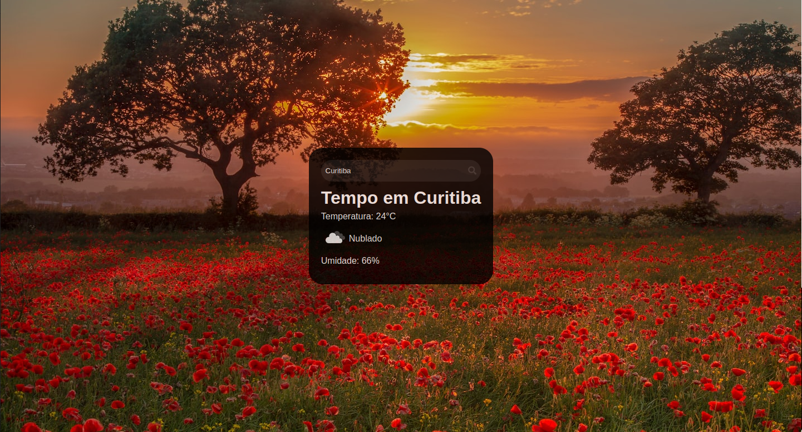

# Weather App / Aplicativo de Previsão do Tempo

Este é um aplicativo de previsão do tempo simples construído com React e integrado à API do OpenWeatherMap.

## Pré-Visualização



## Instalação:

1. Clone este repositório: 
```
git clone https://github.com/joaovlara/weather-app.git
```

2. Navegue até o diretório do projeto: 
```
cd weather-app
```

3. Instale as dependências: 
```
yarn
```

## Configuração da Chave da API:

Você precisará obter uma chave de API gratuita do OpenWeatherMap para usar este aplicativo. Substitua YOUR_API_KEY pela sua chave no arquivo App.js:

```
const key = "YOUR_API_KEY";
```

- **Documentação da API**: https://openweathermap.org/api


## Execução:

Após configurar a chave da API, você pode iniciar o aplicativo: 

```
yarn start
```

O aplicativo estará disponível em http://localhost:3000

## Utilização:
Digite o nome da cidade na caixa de pesquisa e pressione Enter ou clique no botão de pesquisa.
O aplicativo mostrará informações sobre o clima atual da cidade pesquisada, incluindo temperatura, descrição do clima e umidade.

## Recursos 

- **React**: Biblioteca JavaScript para criar interfaces de usuário.
- **React DOM**: Fornece métodos específicos para DOM para serem usados em conjunto com o React.
- **React Icons**: Pacote de ícones para aplicativos React.
- **React Scripts**: Scripts para iniciar e construir aplicativos React.
- **Styled Components**: Biblioteca para escrever CSS em JavaScript.
- **Axios**: Cliente HTTP baseado em Promises para fazer requisições AJAX.

## Autor

[João Lara](https://www.linkedin.com/in/joaovlara/)

## Contato

Se você tiver alguma dúvida ou sugestão sobre o projeto, sinta-se à vontade para entrar em contato comigo em [joaovdelara@gmail.com](joaovdelara@gmail.com) ou através do meu [LinkedIn](https://www.linkedin.com/in/joaovlara/).

## Status do Projeto

Este projeto está atualmente em desenvolvimento.

---
